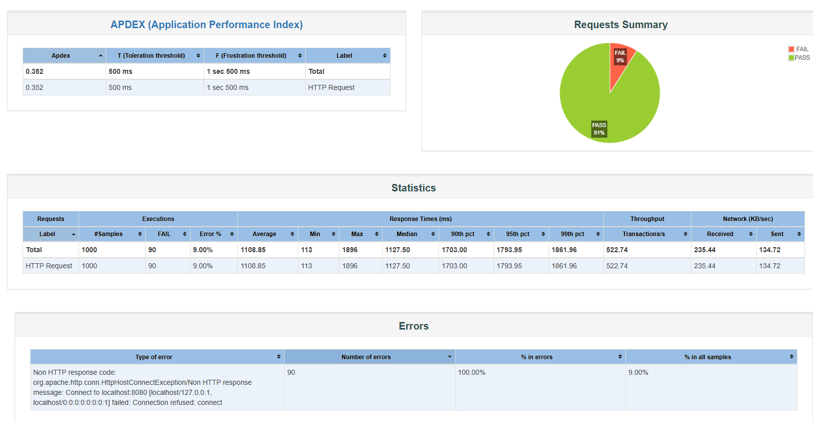
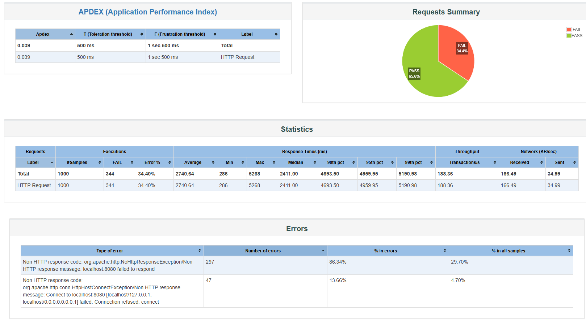

Для обеспечения консистентности в конкурентной среде используется пессимистическая блокировка на запись.

```
@Lock(LockModeType.PESSIMISTIC_WRITE)
@Query("SELECT a FROM Account a WHERE a.id = :id")
Optional<Account> findByIdAndLock(@Param("id") UUID id);
```

http://localhost:8080/swagger-ui/index.html - Swagger

Запуск контейнеров (jar уже находится в репо, никаких доп. манипуляций не нужно)

`docker-compose up --build`

## Тестирование

### Модульное и интеграционное тестирование

Тесты в src/test/java/org/example/bank/TestBankAccountApplicationTests.java

Для удобства тестирование происходит во встроенной базе H2. H2 поддерживает 
блокировки и весь функционал, который использует приложение.
В случае, если приложение использовало бы специфичные функции, доступные только
PostgreSQL, необходимо было бы использовать Testcontainers 
(P.S. добавить только подключение, сами тесты менять не нужно)

В начале идет проверка базовых случаев. Далее - тесты для проверки консистентности 
(testLockWithTenOperationPerThread() и testLockWithTenThousandsOperationPerThread)

testLockWithTenThousandsOperationPerThread(https://github.com/stepanshvets/TestBank/blob/master/src/test/java/org/example/bank/TestBankAccountApplicationTests.java#191) - создает три потока, запущенных одновременно
и выполняющих 10000 операций.

Все тесты пройдены.

## Нагрузочное тестирование. JMeter

Нагрузка в 1000 пользователей без дополнительных настроек - 
иногда отказывает сервер



Если запустить два интстенса и добавить балансировщик (nginx) - нагрузку тоже не проходит.
Хуже, возможно, из-за ограничений Docker'а



Скорее всего, в тз необходимо было просто предусмотреть, что загрузка сможет в теории работать с 1000 RPS 
и обеспечивать консистентость при 1000 RPS, на локальной машине повторить такие цифры будет очень трудно.
Как раз получаем, что серевер перегружен, а не 5XX коды. Либо же сам  JMeter не справляется


